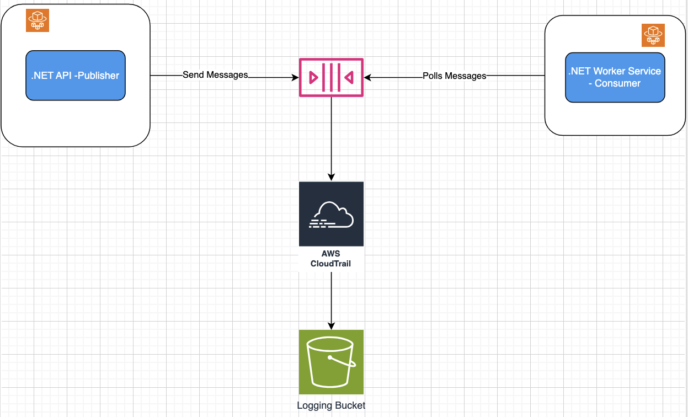

# SQS Implmentation in Dotnet Core

This is a Hands on project that explain how AWS SQS service can be implmented in .net either as a publisher or consumer.

What is AWS SQS Service? SQS is a serverless AWS service that can be used to send, store and recieve messages between software component. SQS can be used to decouple communications between software components or application tiers.

 ## Architecture Flow With Redrive Policy

 - A .NET API would be implemented as a SQS producer which send messages to the queue and a .NET worker service as a consumer which would consumer messages from the queue. 
 - I have opted out for a FIFO type of queue because I want the order of my messages to be strictly preserved and also I do not want duplicate messages in my queue. I would only have used a standard queue for if I wanted a higher throughput.
 - The messages sent from the publisher to the queue would also include some metadata about that messge. Metadata will include
     - Id - Unique Identifier
     - Event type which describe the nature of the message
     - published Data - time the message was published.
  
- Every actions or api request made to SQS would be captured by Cloud Trail in form of events and these events would be then further sent to an Amazone S3 Bucket.
- Both .net applications would be running seperate docker containers, which would then be deployed on AWS Fargate. I choose AWS Fargate over AWS ECS because I really don't want to be creating and managing compute resources.

## Redrive Policy

- Both .net applications would be running seperate docker containers, which would then be deployed on AWS Fargate. I choose AWS Fargate over AWS ECS because I really don't want to be creating and managing compute resources.

## References

1. https://www.youtube.com/watch?v=es4Bu6H7_zE
2. https://aws.amazon.com/what-is/dead-letter-queue/#:~:text=A%20dead%2Dletter%20queue%20(DLQ)%20is%20a%20special%20type,cannot%20process%20due%20to%20errors.

